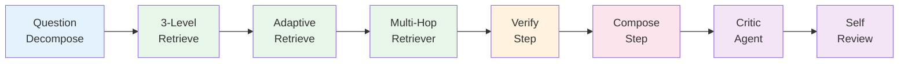

# RAG Pipeline

> 참조 시점: RAG 파이프라인 디버깅, 검색/답변 품질 이슈, 비용 최적화, 새 파이프라인 단계 추가 시

## 파이프라인 흐름 (8단계)



## 단계별 상세

### 1. DECOMPOSE (Light 모델)
- 복합 질문 → 하위 질문 분리 (최대 5개)
- `OpenAiQuestionDecomposerService` / `RegexQuestionDecomposerService` (fallback)
- 각 하위 질문에 productFamily 추출 (`ProductExtractorService`)

### 2. RETRIEVE (3-Level Fallback)
- **Level 0**: 추출된 productFamily 필터로 per-question 검색
- **Level 1**: 카테고리 확장 검색 (`ProductFamilyRegistry.expand()`)
- **Level 2**: 필터 없이 전체 검색
- 각 Level: QueryTranslation → HyDE → HybridSearch(Vector+Keyword) → Reranking → EvidenceQualityGate

### 3. ADAPTIVE RETRIEVE (Light 모델)
- 3-Level 모두 0건일 때 트리거
- 통합 LLM 호출로 3개 변형 쿼리 생성 (expand, broaden, translate)
- **중요**: 성공 시 `rebuildPerQuestionMapping()`으로 per-question 증거 재분배

### 4. MULTI-HOP (Medium 모델, 조건부)
- topScore < 0.7 OR 증거 < 3건일 때 트리거
- 1차 결과 평가 → 필요 시 2차 검색 쿼리 생성

### 5. VERIFY (Medium 모델)
- JSON mode로 verdict 구조화: SUPPORTED / CONDITIONAL / REFUTED
- 위치 가중 점수: 1위=1.0, 2위=0.5, 3위=0.33...
- Risk flags: CONFLICTING_EVIDENCE, LOW_CONFIDENCE, WEAK_EVIDENCE_MATCH

### 6. COMPOSE (Heavy 모델)
- 증거 기반 한국어 답변 작성 (길선체 / brief / technical 톤)
- 토큰 기반 증거 예산 (`rag.compose.evidence-token-budget: 3000`)
- 압축 포맷: `[index|fileName:page|sourceType|score] excerpt`
- **영문 증거도 반드시 활용하여 한국어로 답변** (compose-system.txt 규칙5)

### 7. CRITIC (Heavy 모델, 조건부)
- 스킵 조건: HIGH_CONFIDENCE (topScore≥0.80 && confidence≥0.75), 증거풍부, 단순문의, 예산부족
- faithfulness_score < 0.70 → 재작성 트리거 (최대 2회)

### 8. SELF_REVIEW (규칙 기반, LLM 없음)
- 중복 문장, 팬텀 제품명, 수치 불일치, 인용 오류, 하위 질문 누락 탐지

## 비용 제어

### TokenBudgetManager
- 문의당 최대 25,000 토큰 (설정: `rag.budget.max-tokens-per-inquiry`)
- 필수 단계: DECOMPOSE, RETRIEVE, VERIFY, COMPOSE (예산 면제)
- 선택 단계: CRITIC, SELF_REVIEW, ADAPTIVE_RETRIEVE, MULTI_HOP, RERANKING (예산 초과 시 스킵)

### 토큰 추적
- `PipelineTraceContext`에서 단계별 prompt/completion 토큰 기록
- `RagPipelineMetricEntity`에 total_tokens, estimated_cost_usd 저장

### 하이퍼파라미터 (`application.yml` → `rag:` 섹션)
```yaml
rag:
  budget: { max-tokens-per-inquiry: 25000 }
  evidence: { max-items: 8, min-score: 0.30, max-per-document: 3 }
  confidence: { high-confidence-score: 0.80, supported-threshold: 0.70 }
  chunking: { parent-size: 1500, child-size: 400, overlap: 300 }
  circuit-breaker: { failure-threshold: 3, reset-timeout-seconds: 30 }
```

## 주의사항

- 첨부 문서 없는 문의는 KB만 검색 → per-question 검색에서 productFamily 필터 주의
- Adaptive Retrieve 성공 후 반드시 `perQuestionEvidences` 재구성 필요 (2026-03 버그 수정)
- `toEvidenceItems()`는 DB 메타데이터 보강 필수 (fileName, pageStart, pageEnd)
- 영문 매뉴얼 증거도 한국어 답변에 활용되도록 compose 프롬프트에 명시
