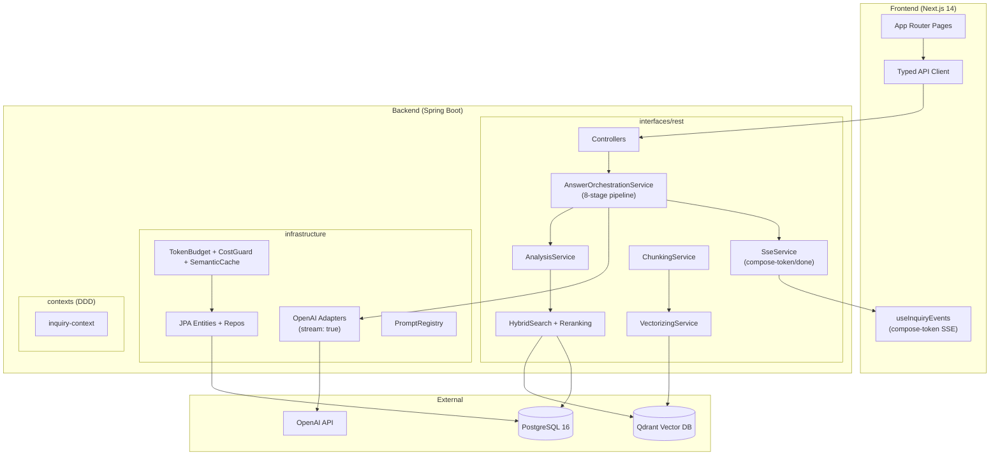

# CLAUDE.md

# language
한국어로 대답해줘

## Project Overview

Bio-Rad CS 대응 허브 — RAG 기반 멀티 에이전트 컨설팅 앱. CS 상담원이 기술 질문+문서를 제출하면 8단계 RAG 파이프라인으로 답변 초안을 **실시간 스트리밍 생성**하고, 사람이 검토/승인 후 발송.

**Tech Stack**: Spring Boot 3.3.8 / Java 21 / Gradle | Next.js 14 / React 18 / TypeScript | PostgreSQL 16 | Qdrant | OpenAI API (stream: true)

## Architecture



### RAG Pipeline (8단계 + Streaming)
```
DECOMPOSE → RETRIEVE(3-level) → ADAPTIVE_RETRIEVE → MULTI_HOP
    → VERIFY → COMPOSE(🔴 stream:true) → CRITIC(🔴 stream:true) → SELF_REVIEW
                   ↓ 토큰 단위 SSE
             compose-token → compose-done → pipeline-step:COMPLETED
```

## Commands

```bash
# ── Backend ──
cd backend
./gradlew build                         # build + test + coverage
./gradlew :app-api:bootRun              # dev server (:8081)
./gradlew :app-api:test                 # tests only
./gradlew :app-api:bootJar -x test      # production JAR

# ── Frontend ──
cd frontend
npm run dev                             # dev server (:3001)
npm run build                           # static export → out/
npm run lint                            # ESLint

# ── Docker (Full Stack) ──
cd infra && docker compose up -d --build  # Postgres + Backend + Frontend
```

## Environment

```bash
cp .env.example .env  # then fill OPENAI_API_KEY, etc.
```
| 변수 | 설명 |
|------|------|
| `OPENAI_ENABLED` | `true`: 실제 OpenAI (스트리밍), `false`: Mock 서비스 (20ms 시뮬레이션) |
| `VECTOR_DB_PROVIDER` | `mock` / `qdrant` / `pinecone` / `weaviate` |
| `SPRING_PROFILES_ACTIVE=docker` | docker-compose용 PostgreSQL 연결 |

## Key Rules

1. **DDD 경계 준수** — context 모듈 간 직접 의존 금지, app-api 오케스트레이션 경유
2. **TDD** — 도메인/유스케이스 테스트 우선, 외부 의존성은 Mock/Real 이중 구현 (`@ConditionalOnProperty`)
3. **빌드 통과 후 커밋** — `./gradlew build` + `npm run build` 모두 성공해야 함
4. **시크릿 커밋 금지** — `.env`는 gitignore, `.env.example`만 커밋
5. **한국어 UI / 영문 API** — API는 영문 enum, 프론트엔드에서 `labels.ts`로 한국어 변환
6. **커밋 컨벤션** — `feat|fix|refactor|docs|test|chore|perf|ci(scope): description`

## Reference Docs

작업에 따라 아래 문서를 참조하세요:

| 문서 | 참조 시점 | 경로 |
|------|----------|------|
| Backend Architecture | 백엔드 구조/패턴 이해, 서비스 추가 시 | `.claude/docs/reference/backend-architecture.md` |
| Frontend Guide | 프론트엔드 컴포넌트/페이지 개발 시 | `.claude/docs/reference/frontend-guide.md` |
| API Endpoints | API 호출 작성/수정, 워크플로 이해 시 | `.claude/docs/reference/api-endpoints.md` |
| RAG Pipeline | RAG 파이프라인 디버깅, 검색/답변 품질 이슈 시 | `.claude/docs/reference/rag-pipeline.md` |
| Deployment | 배포, 인프라, Terraform 작업 시 | `.claude/docs/reference/deployment.md` |
| DB & Migrations | Flyway 마이그레이션 추가, 스키마 변경 시 | `.claude/docs/reference/database-migrations.md` |

## Skills

### 검증 스킬

| 스킬 | 설명 |
|------|------|
| `manage-skills` | 세션 변경사항 분석 및 검증 스킬 유지보수 |
| `verify-implementation` | 등록된 verify 스킬 통합 실행 |
| `verify-kb-indexing` | KB 비동기 인덱싱 파이프라인 검증 |
| `verify-flyway-migrations` | Flyway DB 마이그레이션 일관성 검증 |
| `verify-frontend-ui` | 프론트엔드 UI 컴포넌트 품질 검증 |
| `verify-rag-pipeline` | RAG 파이프라인 (답변 작성 + 분석 + 다운로드) 검증 |
| `verify-inquiry-ui` | 문의 상세 페이지 UI 컴포넌트 검증 |
| `verify-security` | 보안 검증 (RateLimitFilter, RBAC, CORS, JWT, 시크릿) |
| `verify-api-contracts` | REST API 응답 DTO 일관성 + 에러 코드 표준 검증 |

### 배포 스킬

| 스킬 | 설명 |
|------|------|
| `deploy-backend` | 백엔드 배포 (JAR 빌드 → SCP → Docker 재시작) |
| `deploy-frontend` | 프론트엔드 배포 (static export → SCP → nginx) |

### 개발 생산성 스킬

| 스킬 | 설명 |
|------|------|
| `add-flyway-migration` | Flyway 마이그레이션 파일 생성 + JPA 엔티티 동기화 |
| `scaffold-openai-service` | OpenAI/Mock 이중 구현 스캐폴딩 (@ConditionalOnProperty) |
| `add-api-endpoint` | REST API DDD 레이어 스캐폴딩 (Controller → UseCase → JPA) |

### 분석/디버깅 스킬

| 스킬 | 설명 |
|------|------|
| `analyze-llm-cost` | LLM 모델별 비용 분석 + 티어 변경 시뮬레이션 |
| `troubleshoot-rag` | RAG 파이프라인 디버깅 (검색 품질, 할루시네이션, 인용 오류) |
